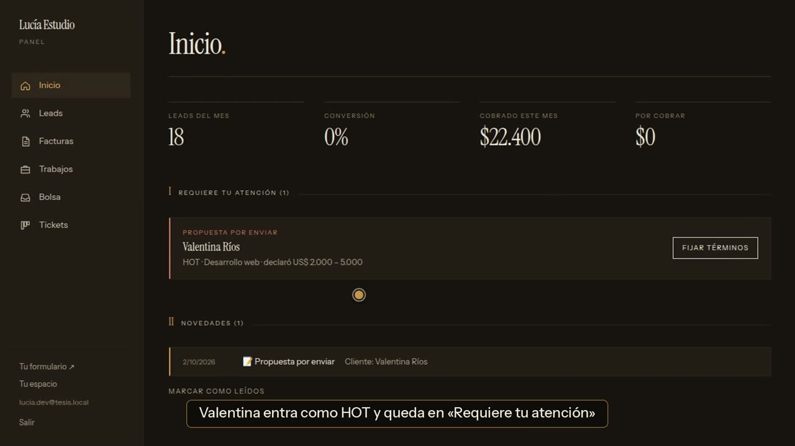
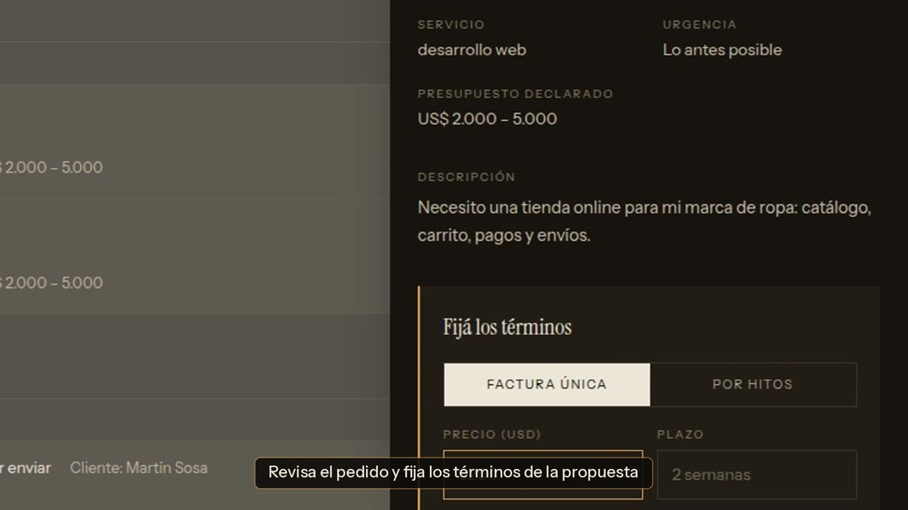
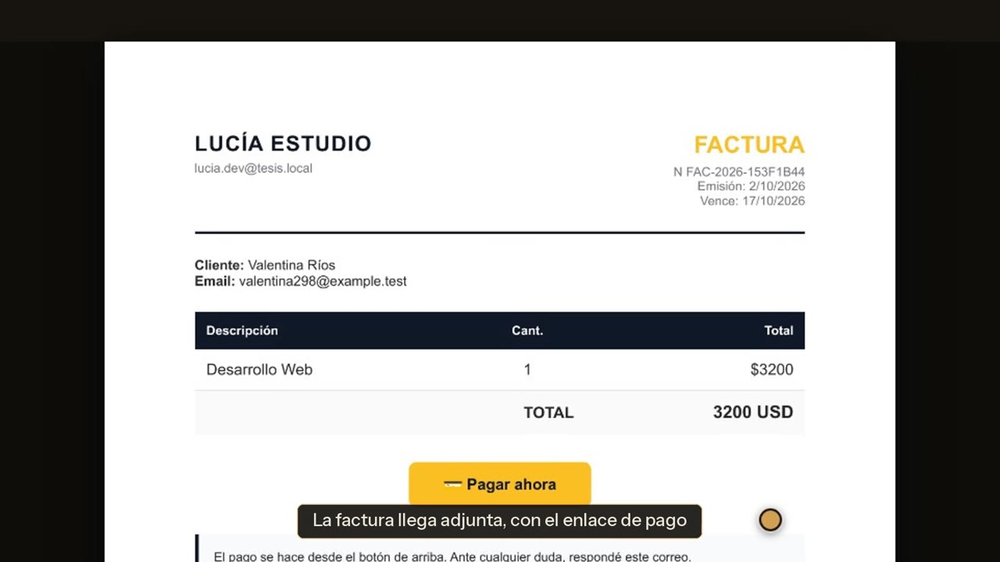
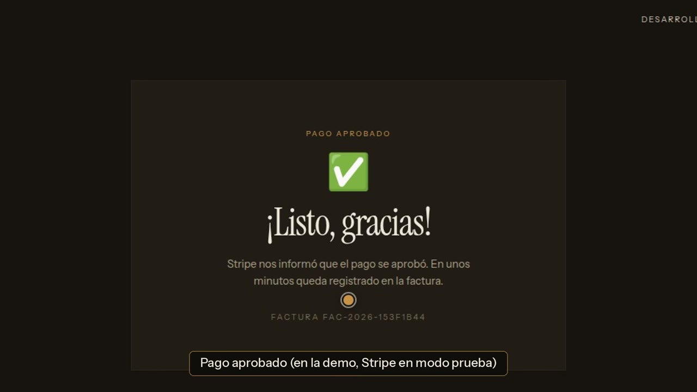
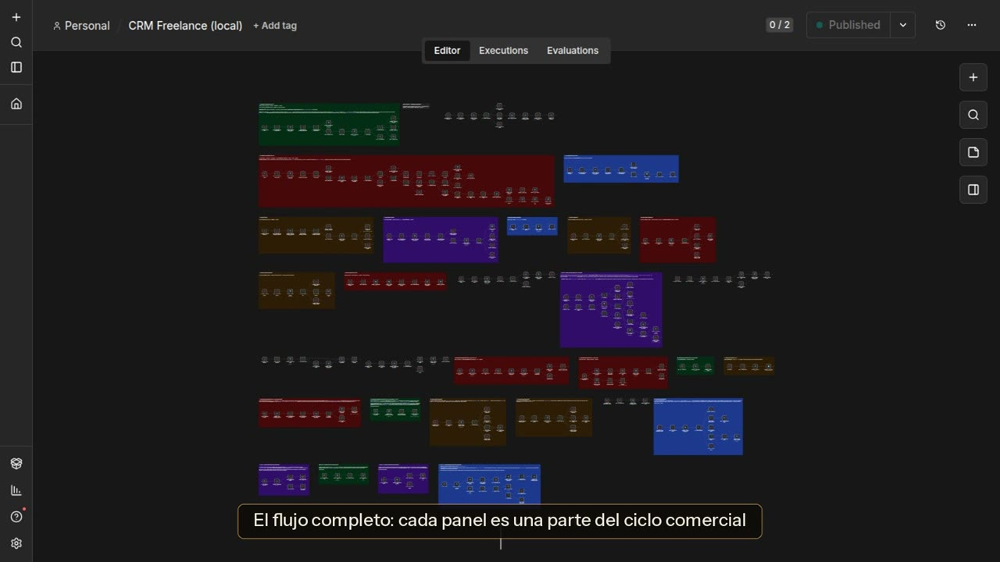
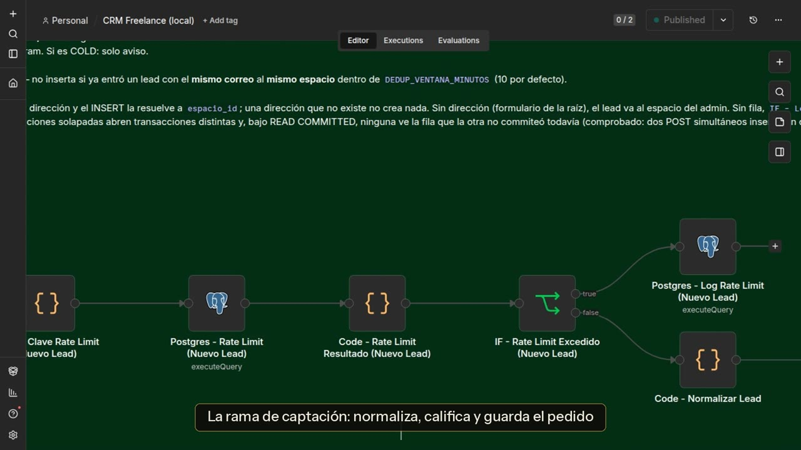

# FormularioLeads

**CRM automatizado para freelancers.** De la consulta al cobro sin tareas manuales: el pedido entra
calificado, la propuesta se acepta en línea, la factura sale sola en PDF y el pago actualiza el panel en
tiempo real. Sobre esa base, una plataforma donde varios desarrolladores tienen su espacio, los clientes
publican proyectos y el pago se protege por hitos.

**Stack:** Next.js 16 · React 19 · n8n · Supabase (PostgreSQL + RLS + Realtime) · Stripe Connect · Gotenberg · Docker

## Demo en video

[](docs/media/demo.mp4)

▶ **[Ver el video completo (1:40)](docs/media/demo.mp4)**: el recorrido real del sistema, desde el
formulario hasta el cobro y el flujo de n8n.

Un pedido nuevo aparece solo en el panel, ya calificado:


## Qué hace

| | |
|---|---|
|  |  |
| **Panel en tiempo real.** Cada consulta entra calificada como HOT, WARM o COLD. | **Propuesta.** El desarrollador fija precio, plazo y alcance; el cliente acepta, rechaza o pide cambios. |
|  |  |
| **Factura automática.** HTML convertido a PDF con Gotenberg y enviado por correo. | **Cobro.** Stripe Connect en USD, con la comisión de la plataforma descontada. |

**Para el desarrollador**
- Formulario público propio (`/f/<espacio>`) y panel con «Requiere tu atención».
- Tablero de trabajo con tickets que suben solos de prioridad si nadie los toca.
- Avisos en el panel, por correo y por Telegram.

**Para el cliente**
- Publica un proyecto, recibe postulaciones y conversa con los postulantes; los datos de contacto quedan
  ocultos hasta que elige.
- Paga por hitos: la plata queda retenida hasta que aprueba la entrega, se libera sola a los 7 días y,
  si hay un problema, abre una disputa.
- Califica con estrellas al cerrar; la reputación se ve en el perfil público del desarrollador.

**Bolsa de proyectos.** Si un desarrollador no puede tomar un pedido y el cliente lo autorizó, el pedido
se publica sin datos personales para que otros se postulen.

## Arquitectura

```
Navegador ──▶ Next.js (web/) ──▶ n8n (workflow/) ──▶ PostgreSQL en Supabase (db/)
                   │                    │
                   └─ lee con sesión ───┘── Gotenberg (PDF) · Stripe · Gmail · Telegram
                      y RLS por espacio
```

- El front nunca escribe en las tablas de negocio: las mutaciones pasan por n8n o por funciones
  `SECURITY DEFINER` acotadas. El panel lee con la clave pública bajo sesión y RLS por espacio.
- Aceptación atómica por token, pagos idempotentes con firma verificada, rate limiting en los webhooks
  públicos y conciliación manual de los casos inciertos.
- El flujo principal de n8n tiene 21 webhooks, 9 procesos programados y 314 nodos funcionales,
  ordenados en una rama por cada parte del ciclo comercial:

| | |
|---|---|
|  |  |

## Estructura

```
web/         Front Next.js (App Router)
workflow/    Workflows de n8n: CRM, avisos, tickets y bot de Telegram
db/          Esquema PostgreSQL: tablas, vistas, funciones y RLS
tests/       Pruebas del workflow y del esquema
scripts/     Renderizado de CORS, manifiesto, orden del lienzo y cuentas de demo
docs/        Guía técnica, seguridad, módulos y despliegue
```

## Empezar

```bash
git clone https://github.com/Boit-6/crm-freelancers-n8n.git
cd crm-freelancers-n8n
cp .env.example .env && docker compose up -d     # n8n + Gotenberg
cd web && cp .env.example .env.local && npm install && npm run dev
```

Antes hay que aplicar `db/schema.sql` en Supabase e importar los workflows en n8n: los pasos completos
están en la [guía técnica](docs/guia-tecnica.md).

## Pruebas

| Comando | Qué cubre |
|---|---|
| `npm test` | Los nodos Code del workflow, el scoring, la firma de Stripe, el escape de HTML y los pagos, sin levantar nada |
| `npm run test:docker` | Cada consulta de los workflows compilada contra el esquema, 291 casos de RLS y la idempotencia, sobre un PostgreSQL desechable |
| `npm run test:front` | 240 pruebas de Vitest y Testing Library del front |
| `npm run test:escenarios` | El ciclo completo contra el sistema levantado |

El CI corre las tres primeras, además de lint, tipos, build y un escaneo de secretos.

## Documentación

- [Guía técnica](docs/guia-tecnica.md): arquitectura, instalación y pruebas.
- [Seguridad](docs/seguridad.md): qué protege cada decisión y con qué prueba se verifica.
- Módulos: [pagos con Stripe Connect](docs/modulo-pagos.md), [pago protegido por hitos](docs/modulo-hitos.md)
  y [tickets](docs/modulo-tickets.md).
- [Despliegue de la demo](docs/despliegue-demo.md) y [aviso de privacidad](docs/privacidad-ley-25326.md).

## Origen

Empezó como mi Trabajo Final de la Tecnicatura Universitaria en Programación (UTN FRM), que hice con Mateo
Morgui. Después lo convertí en una plataforma de varios desarrolladores, con bolsa de proyectos, mensajes,
reputación y pago protegido por hitos.
